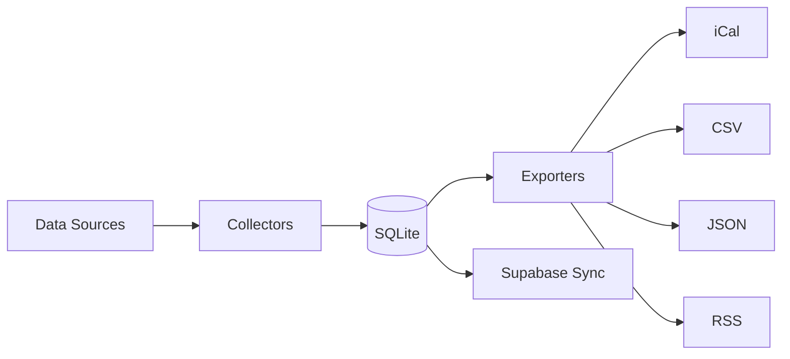
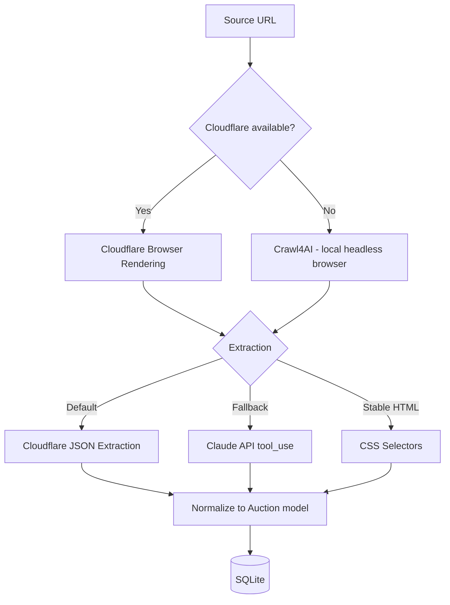

# TDC Auction Calendar

A Python CLI tool that collects, merges, and exports tax deed auction dates from county and state sources. Outputs iCal, JSON, CSV, and RSS feeds. Each auction record carries a confidence score based on its data source — statutory baselines score lowest, county website scrapes score highest.

## Quick Start

**Prerequisites:** [uv](https://docs.astral.sh/uv/getting-started/installation/) (Python package manager)

```bash
# Clone and install
git clone https://github.com/mretrop/tdc-auction-calendar.git
cd tdc-auction-calendar
uv sync

# Collect statutory auction data (no API keys needed)
uv run tdc-auction-calendar collect --collectors statutory

# Export to iCal
uv run tdc-auction-calendar export ical -o auctions.ics

# View upcoming auctions
uv run tdc-auction-calendar list
```

The `statutory` collector reads from seed data files and requires no external API keys. The database is created automatically on first run. For web-scraping collectors, see [Configuration](#configuration).

## CLI Reference

All commands support `--help` for full option details.

### Global Options

| Option | Description |
|--------|-------------|
| `--verbose` / `-v` | Enable debug logging |
| `--db-path PATH` | Override `DATABASE_URL` for this run |

### Commands

| Command | Description |
|---------|-------------|
| `collect` | Run collectors and persist auction data to the database |
| `list` | List upcoming auctions with filters |
| `status` | Show database stats and collector health |
| `states` | List all states with sale type and typical months |
| `counties` | List counties with vendor and tax sale page info |

#### `collect`

```bash
# Run all collectors
uv run tdc-auction-calendar collect

# Run specific collectors
uv run tdc-auction-calendar collect --collectors statutory --collectors florida_public_notice
```

| Option | Description |
|--------|-------------|
| `--collectors NAME` | Collector names to run (repeatable). Omit for all. |

Available collectors: `statutory`, `arkansas_state_agency`, `california_state_agency`, `colorado_state_agency`, `iowa_state_agency`, `florida_public_notice`, `minnesota_public_notice`, `new_jersey_public_notice`, `north_carolina_public_notice`, `pennsylvania_public_notice`, `south_carolina_public_notice`, `utah_public_notice`, `county_website`

#### `list`

```bash
uv run tdc-auction-calendar list --state FL --limit 20
```

| Option | Description |
|--------|-------------|
| `--state CODE` | Filter by state code (e.g., FL) |
| `--sale-type TYPE` | Filter by sale type (deed, lien, hybrid) |
| `--from-date DATE` | Start date (YYYY-MM-DD) |
| `--to-date DATE` | End date (YYYY-MM-DD) |
| `--limit N` | Max rows to display (default: 50) |

### Export Subcommands

All export commands share these options:

| Option | Description |
|--------|-------------|
| `--state CODE` | Filter by state code (repeatable) |
| `--sale-type TYPE` | Filter by sale type |
| `--from-date DATE` | Start date (YYYY-MM-DD) |
| `--to-date DATE` | End date (YYYY-MM-DD) |
| `--upcoming-only` | Only include upcoming auctions |
| `--output` / `-o` | Output file (default: stdout) |

```bash
# iCalendar
uv run tdc-auction-calendar export ical -o auctions.ics

# CSV
uv run tdc-auction-calendar export csv --state FL --state TX -o florida-texas.csv

# JSON
uv run tdc-auction-calendar export json --upcoming-only --compact

# RSS
uv run tdc-auction-calendar export rss --state FL --days 30 -o feed.xml
```

The `rss` command also accepts `--days N` (shortcut: sets `--from-date` to N days ago, overrides `--from-date` if both provided).

### Sync Subcommands

```bash
# Upsert auctions to Supabase
uv run tdc-auction-calendar sync supabase
```

Requires `SUPABASE_URL` and `SUPABASE_SERVICE_ROLE_KEY` environment variables.

## Configuration

| Variable | Required | Default | Description |
|----------|----------|---------|-------------|
| `DATABASE_URL` | No | `sqlite:///data/auction_calendar.db` | Database connection string |
| `CLOUDFLARE_ACCOUNT_ID` | For scraping | — | Cloudflare Browser Rendering account |
| `CLOUDFLARE_API_TOKEN` | For scraping | — | Cloudflare Browser Rendering token |
| `ANTHROPIC_API_KEY` | For fallback extraction | — | Claude API key (only used when Crawl4AI is the fetcher) |
| `SUPABASE_URL` | For sync | — | Supabase project URL |
| `SUPABASE_SERVICE_ROLE_KEY` | For sync | — | Supabase service role key |
| `SCRAPE_CACHE_DIR` | No | `data/cache` | Directory for scrape response cache |

The `--db-path` CLI option overrides `DATABASE_URL` for a single run.

**Scraping stack:** Cloudflare Browser Rendering is the primary fetcher. If Cloudflare credentials are not set, the system falls back to Crawl4AI (local headless browser). `ANTHROPIC_API_KEY` is only used for LLM-based extraction when Crawl4AI is the fetcher — Cloudflare handles extraction server-side.

## Architecture

### Data Flow



### Collector Tiers

Collectors are organized by data source reliability and update frequency:

| Tier | Schedule | Count | Data Source | Confidence |
|------|----------|-------|-------------|------------|
| Statutory | Weekly | 1 | JSON seed files (state laws) | Baseline |
| State Agencies | Daily | 4 | State government websites | High |
| Public Notices | Twice daily | 7 | Public notice aggregators | High |
| County Websites | Daily | 1 | County tax sale pages | Highest |

Higher-tier collectors override lower-tier data for the same auction (via deduplication on the key: state + county + date + sale type).

### Scraping Stack



## Deployment

### GitHub Actions

Four cron workflows automate collection and sync:

| Workflow | Schedule | Collectors |
|----------|----------|------------|
| `collect-statutory.yml` | Sunday 3am UTC | `statutory` |
| `collect-state-agencies.yml` | Daily 4am UTC | 4 state agency collectors |
| `collect-public-notices.yml` | 6am + 6pm UTC | 7 public notice collectors |
| `collect-county-websites.yml` | Daily 5am UTC | `county_website` |

Each workflow: checkout → install uv → `uv sync --no-dev` → `collect` → `sync supabase`.

**Required GitHub secrets:** `SUPABASE_URL`, `SUPABASE_SERVICE_ROLE_KEY`, `CLOUDFLARE_ACCOUNT_ID`, `CLOUDFLARE_API_TOKEN`, `ANTHROPIC_API_KEY`

All workflows support manual triggering via `workflow_dispatch`.

### Database Strategy

The CI database is ephemeral — each workflow run starts with a fresh SQLite database, collects data, syncs to Supabase, and discards the database. Supabase is the source of truth for production data.

## License

MIT
