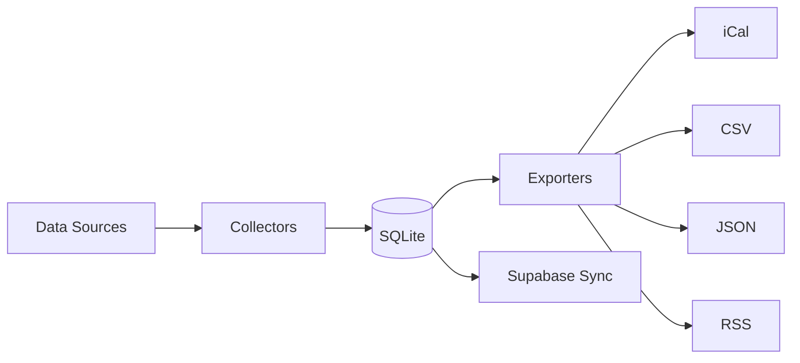
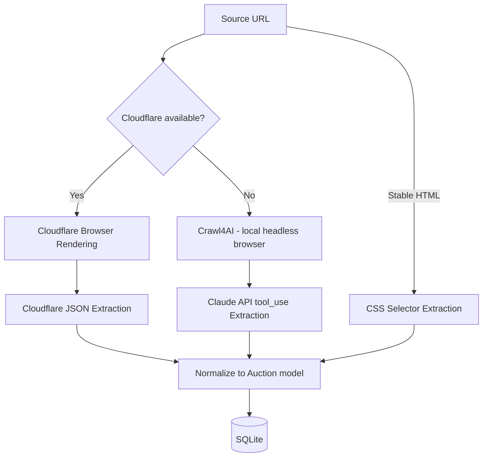

# Documentation (README + CONTRIBUTING.md) Implementation Plan

> **For agentic workers:** REQUIRED: Use superpowers:subagent-driven-development (if subagents available) or superpowers:executing-plans to implement this plan. Steps use checkbox (`- [ ]`) syntax for tracking.

**Goal:** Create comprehensive README.md and CONTRIBUTING.md for the tdc-auction-calendar project (issue #26).

**Architecture:** Two markdown files — README.md for users (overview, quick start, CLI reference, env vars, architecture, deployment) and CONTRIBUTING.md for developers (setup, adding collectors, adding county URLs, test fixtures, known limitations).

**Tech Stack:** Markdown, Mermaid diagrams

---

## File Structure

| File | Purpose |
|------|---------|
| `README.md` | User-facing documentation: what the tool does, how to install and use it |
| `CONTRIBUTING.md` | Contributor-facing documentation: how to add collectors, county URLs, test fixtures |

---

## Chunk 1: README.md

### Task 1: Write README.md

**Files:**
- Create: `README.md`

- [ ] **Step 1: Write the README**

Create `README.md` with the following content:

````markdown
# TDC Auction Calendar

A Python CLI tool that collects, merges, and exports tax deed auction dates from county and state sources. Outputs iCal, JSON, CSV, and RSS feeds. Each auction record carries a confidence score based on its data source — statutory baselines score lowest, county website scrapes score highest.

## Quick Start

**Prerequisites:** [uv](https://docs.astral.sh/uv/getting-started/installation/) (Python package manager)

```bash
# Clone and install
git clone https://github.com/mretrop/tdc-auction-calendar.git
cd tdc-auction-calendar
uv sync

# Collect statutory auction data (no API keys needed)
uv run tdc-auction-calendar collect --collectors statutory

# Export to iCal
uv run tdc-auction-calendar export ical -o auctions.ics

# View upcoming auctions
uv run tdc-auction-calendar list
```

The `statutory` collector reads from seed data files and requires no external API keys. The database is created automatically on first run. For web-scraping collectors, see [Configuration](#configuration).

## CLI Reference

All commands support `--help` for full option details.

### Global Options

| Option | Description |
|--------|-------------|
| `--verbose` / `-v` | Enable debug logging |
| `--db-path PATH` | Override `DATABASE_URL` for this run |

### Commands

| Command | Description |
|---------|-------------|
| `collect` | Run collectors and persist auction data to the database |
| `list` | List upcoming auctions with filters |
| `status` | Show database stats and collector health |
| `states` | List all states with sale type and typical months |
| `counties` | List counties with vendor and tax sale page info |

#### `collect`

```bash
# Run all collectors
uv run tdc-auction-calendar collect

# Run specific collectors
uv run tdc-auction-calendar collect --collectors statutory --collectors florida_public_notice
```

| Option | Description |
|--------|-------------|
| `--collectors NAME` | Collector names to run (repeatable). Omit for all. |

Available collectors: `statutory`, `arkansas_state_agency`, `california_state_agency`, `colorado_state_agency`, `iowa_state_agency`, `florida_public_notice`, `minnesota_public_notice`, `new_jersey_public_notice`, `north_carolina_public_notice`, `pennsylvania_public_notice`, `south_carolina_public_notice`, `utah_public_notice`, `county_website`

#### `list`

```bash
uv run tdc-auction-calendar list --state FL --limit 20
```

| Option | Description |
|--------|-------------|
| `--state CODE` | Filter by state code (e.g., FL) |
| `--sale-type TYPE` | Filter by sale type (deed, lien, hybrid) |
| `--from-date DATE` | Start date (YYYY-MM-DD) |
| `--to-date DATE` | End date (YYYY-MM-DD) |
| `--limit N` | Max rows to display (default: 50) |

### Export Subcommands

All export commands share these options:

| Option | Description |
|--------|-------------|
| `--state CODE` | Filter by state code (repeatable) |
| `--sale-type TYPE` | Filter by sale type |
| `--from-date DATE` | Start date (YYYY-MM-DD) |
| `--to-date DATE` | End date (YYYY-MM-DD) |
| `--upcoming-only` | Only include upcoming auctions |
| `--output` / `-o` | Output file (default: stdout) |

```bash
# iCalendar
uv run tdc-auction-calendar export ical -o auctions.ics

# CSV
uv run tdc-auction-calendar export csv --state FL --state TX -o florida-texas.csv

# JSON
uv run tdc-auction-calendar export json --upcoming-only --compact

# RSS
uv run tdc-auction-calendar export rss --state FL --days 30 -o feed.xml
```

The `rss` command also accepts `--days N` (auctions from the last N days).

### Sync Subcommands

```bash
# Upsert auctions to Supabase
uv run tdc-auction-calendar sync supabase
```

Requires `SUPABASE_URL` and `SUPABASE_SERVICE_ROLE_KEY` environment variables.

## Configuration

| Variable | Required | Default | Description |
|----------|----------|---------|-------------|
| `DATABASE_URL` | No | `sqlite:///data/auction_calendar.db` | Database connection string |
| `CLOUDFLARE_ACCOUNT_ID` | For scraping | — | Cloudflare Browser Rendering account |
| `CLOUDFLARE_API_TOKEN` | For scraping | — | Cloudflare Browser Rendering token |
| `ANTHROPIC_API_KEY` | For fallback extraction | — | Claude API key (only used when Crawl4AI is the fetcher) |
| `SUPABASE_URL` | For sync | — | Supabase project URL |
| `SUPABASE_SERVICE_ROLE_KEY` | For sync | — | Supabase service role key |
| `SCRAPE_CACHE_DIR` | No | `data/cache` | Directory for scrape response cache |

The `--db-path` CLI option overrides `DATABASE_URL` for a single run.

**Scraping stack:** Cloudflare Browser Rendering is the primary fetcher. If Cloudflare credentials are not set, the system falls back to Crawl4AI (local headless browser). `ANTHROPIC_API_KEY` is only used for LLM-based extraction when Crawl4AI is the fetcher — Cloudflare handles extraction server-side.

## Architecture

### Data Flow



### Collector Tiers

Collectors are organized by data source reliability and update frequency:

| Tier | Schedule | Count | Data Source | Confidence |
|------|----------|-------|-------------|------------|
| Statutory | Weekly | 1 | JSON seed files (state laws) | Baseline |
| State Agencies | Daily | 4 | State government websites | High |
| Public Notices | Twice daily | 7 | Public notice aggregators | High |
| County Websites | Daily | 1 | County tax sale pages | Highest |

Higher-tier collectors override lower-tier data for the same auction (via deduplication on the key: state + county + date + sale type).

### Scraping Stack



## Deployment

### GitHub Actions

Four cron workflows automate collection and sync:

| Workflow | Schedule | Collectors |
|----------|----------|------------|
| `collect-statutory.yml` | Sunday 3am UTC | `statutory` |
| `collect-state-agencies.yml` | Daily 4am UTC | 4 state agency collectors |
| `collect-public-notices.yml` | 6am + 6pm UTC | 7 public notice collectors |
| `collect-county-websites.yml` | Daily 5am UTC | `county_website` |

Each workflow: checkout → install uv → `uv sync --no-dev` → `collect` → `sync supabase`.

**Required GitHub secrets:** `SUPABASE_URL`, `SUPABASE_SERVICE_ROLE_KEY`, `CLOUDFLARE_ACCOUNT_ID`, `CLOUDFLARE_API_TOKEN`, `ANTHROPIC_API_KEY`

All workflows support manual triggering via `workflow_dispatch`.

### Database Strategy

The CI database is ephemeral — each workflow run starts with a fresh SQLite database, collects data, syncs to Supabase, and discards the database. Supabase is the source of truth for production data.

## License

MIT
````

- [ ] **Step 2: Verify the README renders correctly**

Run: `python3 -c "import pathlib; content = pathlib.Path('README.md').read_text(); print(f'README.md: {len(content)} chars, {content.count(chr(10))} lines')"`
Expected: file exists with content

- [ ] **Step 3: Commit**

```bash
git add README.md
git commit -m "docs: add README with quick start, CLI reference, and architecture (issue #26)"
```

---

## Chunk 2: CONTRIBUTING.md

### Task 2: Write CONTRIBUTING.md

**Files:**
- Create: `CONTRIBUTING.md`

- [ ] **Step 1: Write CONTRIBUTING.md**

Create `CONTRIBUTING.md` with the following content:

````markdown
# Contributing

## Development Setup

```bash
git clone https://github.com/mretrop/tdc-auction-calendar.git
cd tdc-auction-calendar
uv sync          # Installs all dependencies including dev tools
uv run pytest    # Verify everything works
```

## Adding a New Collector

This walkthrough uses the Arkansas state agency collector as a reference. You can find the full source at `src/tdc_auction_calendar/collectors/state_agencies/arkansas.py`.

### 1. Create the collector file

Create a new file in the appropriate subdirectory under `src/tdc_auction_calendar/collectors/`:

- `state_agencies/` — for state government data sources
- `public_notices/` — for public notice aggregators
- `county_websites/` — for individual county tax sale pages

### 2. Define an extraction schema

Create a Pydantic model describing what the scraper should extract from the page:

```python
from pydantic import BaseModel

class ArkansasAuctionRecord(BaseModel):
    """Schema for a single Arkansas auction record from COSL."""
    county: str
    sale_date: str
    sale_type: str = "deed"
```

### 3. Define the extraction prompt

Write a natural-language prompt that tells the LLM/Cloudflare what to extract:

```python
_URL = "https://cosl.org"
_PROMPT = (
    "Extract all county tax deed sale dates from this page. "
    "Each row should have county name, sale date, and sale type."
)
```

### 4. Subclass `BaseCollector`

Implement the required properties and methods:

```python
from pydantic import ValidationError

from tdc_auction_calendar.collectors.base import BaseCollector
from tdc_auction_calendar.collectors.scraping import ExtractionError, create_scrape_client
from tdc_auction_calendar.models.auction import Auction
from tdc_auction_calendar.models.enums import SaleType, SourceType

class ArkansasCollector(BaseCollector):

    @property
    def name(self) -> str:
        return "arkansas_state_agency"

    @property
    def source_type(self) -> SourceType:
        return SourceType.STATE_AGENCY

    async def _fetch(self) -> list[Auction]:
        json_options = {
            "prompt": _PROMPT,
            "response_format": ArkansasAuctionRecord.model_json_schema(),
        }
        client = create_scrape_client()
        try:
            result = await client.scrape(_URL, json_options=json_options)
        finally:
            await client.close()

        raw_records: list = (
            result.data
            if isinstance(result.data, list)
            else ([result.data] if result.data is not None else [])
        )

        auctions: list[Auction] = []
        for raw in raw_records:
            try:
                auctions.append(self.normalize(raw))
            except (KeyError, TypeError, ValueError, ValidationError) as exc:
                logger.error("normalize_failed", collector=self.name, raw=raw, error=str(exc))
        if raw_records and not auctions:
            raise ExtractionError(f"{self.name}: all records failed normalization")
        return auctions

    def normalize(self, raw: dict) -> Auction:
        return Auction(
            state="AR",
            county=raw["county"],
            start_date=date.fromisoformat(raw["sale_date"]),
            sale_type=SaleType(raw.get("sale_type", "deed")),
            source_type=SourceType.STATE_AGENCY,
            source_url=_URL,
            confidence_score=0.85,
        )
```

**Key points:**
- Implement `name` and `source_type` as properties
- Implement `_fetch()` (NOT `collect()` — that's already implemented in `BaseCollector` and handles deduplication)
- Implement `normalize()` to convert raw extracted data into an `Auction` model
- Use `create_scrape_client()` for web scraping — it handles Cloudflare/Crawl4AI fallback automatically

### 5. Register in the orchestrator

Add your collector to the `COLLECTORS` dict in `src/tdc_auction_calendar/collectors/orchestrator.py`:

```python
from tdc_auction_calendar.collectors.state_agencies import ArkansasCollector

COLLECTORS: dict[str, type[BaseCollector]] = {
    # ... existing collectors ...
    "arkansas_state_agency": ArkansasCollector,
}
```

### 6. Add to the GitHub Actions workflow

Add the collector name to the appropriate workflow in `.github/workflows/`:

- `collect-state-agencies.yml` for state agency collectors
- `collect-public-notices.yml` for public notice collectors
- `collect-county-websites.yml` for county website collectors

### 7. Write tests

Add tests in `tests/collectors/`. See [Recording Test Fixtures](#recording-test-fixtures) below.

## Adding a County URL

County data lives in `src/tdc_auction_calendar/db/seed/counties.json`. Each entry has:

| Field | Description |
|-------|-------------|
| `state` | Two-letter state code (e.g., `"FL"`) |
| `county_name` | County name (e.g., `"Alachua"`) |
| `known_auction_vendor` | Auction vendor if known (e.g., `"RealAuction"`) or `null` |
| `tax_sale_page_url` | Direct URL to the county's tax sale page, or `null` |
| `priority` | Collection priority: `"high"`, `"medium"`, or `"low"` |

To add or update a county, edit the JSON file and run the seed loader:

```bash
uv run tdc-auction-calendar collect --collectors statutory
```

The seed loader is idempotent — it checks primary key existence before inserting.

## Recording Test Fixtures

Test fixtures live in `tests/fixtures/`. To record a new fixture for a collector:

1. Run the collector with caching enabled (responses are cached in `data/cache/` by default)
2. Copy the cached response to `tests/fixtures/`
3. Write tests that load the fixture and verify `normalize()` output

Example test structure:

```python
import json
import pytest
from tdc_auction_calendar.collectors.state_agencies.arkansas import ArkansasCollector

@pytest.fixture
def collector():
    return ArkansasCollector()

def test_normalize_valid_record(collector):
    raw = {"county": "Pulaski", "sale_date": "2026-06-15", "sale_type": "deed"}
    auction = collector.normalize(raw)
    assert auction.state == "AR"
    assert auction.county == "Pulaski"
    assert auction.source_type.value == "state_agency"
```

## Known Limitations

- **Crawl4AI fallback** requires a local Chromium browser binary. Install with `playwright install chromium` if needed.
- **Rate limiting** — collectors use a built-in rate limiter, but aggressive scraping may still trigger site-level blocks.
- **Seed data coverage** — not all 50 US states have tax sales. Only states with active lien/deed/hybrid auctions are included in the seed data.
- **Redemption periods** — `redemption_period_months` is typically null for deed states, but some (e.g., TX) have statutory redemption periods. This is correct, not a bug.
````

- [ ] **Step 2: Verify the file**

Run: `python3 -c "import pathlib; content = pathlib.Path('CONTRIBUTING.md').read_text(); print(f'CONTRIBUTING.md: {len(content)} chars, {content.count(chr(10))} lines')"`
Expected: file exists with content

- [ ] **Step 3: Commit**

```bash
git add CONTRIBUTING.md
git commit -m "docs: add CONTRIBUTING with collector walkthrough and dev guide (issue #26)"
```

---

## Chunk 3: Final Validation

### Task 3: Validate and close issue

- [ ] **Step 1: Verify acceptance criteria**

Check each criterion from issue #26:
1. **Clone-to-collect in < 10 min**: README Quick Start section covers `git clone → uv sync → collect --collectors statutory` (3 commands, zero config)
2. **All env vars documented**: README Configuration section lists all 7 env vars (`DATABASE_URL`, `CLOUDFLARE_ACCOUNT_ID`, `CLOUDFLARE_API_TOKEN`, `ANTHROPIC_API_KEY`, `SUPABASE_URL`, `SUPABASE_SERVICE_ROLE_KEY`, `SCRAPE_CACHE_DIR`)
3. **Complete collector example**: CONTRIBUTING "Adding a New Collector" section walks through Arkansas collector with full code

- [ ] **Step 2: Verify Mermaid diagrams render**

Run: `grep -c 'mermaid' README.md`
Expected: `2` (data flow diagram + scraping stack diagram)

- [ ] **Step 3: Push and create PR**

```bash
git push origin HEAD
gh pr create --title "docs: README + CONTRIBUTING.md (issue #26)" --body "$(cat <<'EOF'
## Summary
- README.md with quick start, CLI reference, env var table, architecture diagrams, deployment guide
- CONTRIBUTING.md with full collector walkthrough (Arkansas example), county URL guide, test fixture instructions

Closes #26

## Test plan
- [ ] Quick Start steps work from a fresh clone
- [ ] All 7 env vars are documented
- [ ] Mermaid diagrams render on GitHub
- [ ] CONTRIBUTING collector example matches actual code patterns

🤖 Generated with [Claude Code](https://claude.com/claude-code)
EOF
)"
```
